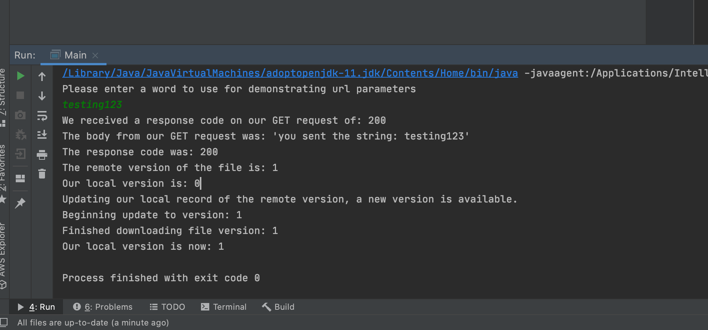

# What is this?
This is a repo to demonstrate building a HTTP Client and HTTP Server in Java 11 without using any external libs.

# Repo Structure
The structure isn't very typical as I was trying to jam everything in here to only have one repo to manage.

The master branch is the starter code, and the branches are labelled with possible solutions, I recommend reaching out for help before looking at the branches if possible.

## Python Directory
The python directory contains an HTTP server and a script that HTTP requests.

The server can handle url parameters on the base url as well as download of a dummyfile.

The client script demonstrates making the appropriate requests. 

Both should be of use when making the Java Client and Server to validate while building both out.

## Java Directory
There are two directories, client and server.

Both have two files, the Main (which doesn't need any modification), and either a Client.java or Server.java which will need modification.

The files that require modification will only have methods and variables declared.

The task at hand will be to take those methods and variables, and implement their functionality.

Screenshot of console output for Client.java:

